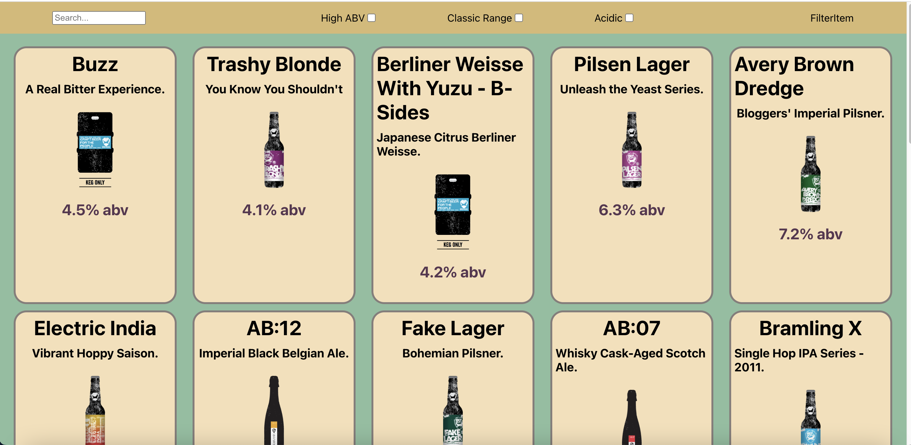

Punk API

Overview
Your task is to build a website using React based on the specifications outline below. This will
be based on the Punk API which contains all the data you will need for the task (there is also a
link to a data file which we recommend you use before diving straight into using the API).
Please refer to Earworm as well as the sandbox apps we built together during the module!
You will have to use all of the skills you have gained over the course of the module to complete
this challenge. Take things slowly and follow Reacts recommendation for building an
application

Plan

Start - All the wire-frame content in black is the first part of the challenge - that is, the side nav,
the main section containing the beers and beer cards for each piece of data. The component
tree is below to help you get started.
Extension 1 - Once you've got the design and layout sorted to render the elements, it's time to
add some search functionality. Make it so you can search the beers by their name, and the page
content should update as you type each letter in the box.
Extension 2 - Finally attempt to make it so you can filter the content on three conditions:
• High Alcohol (ABV value greater than 6%)
• Classic Range (Was first brewed before 2010)
• High Acidity (pH lower than 4)

